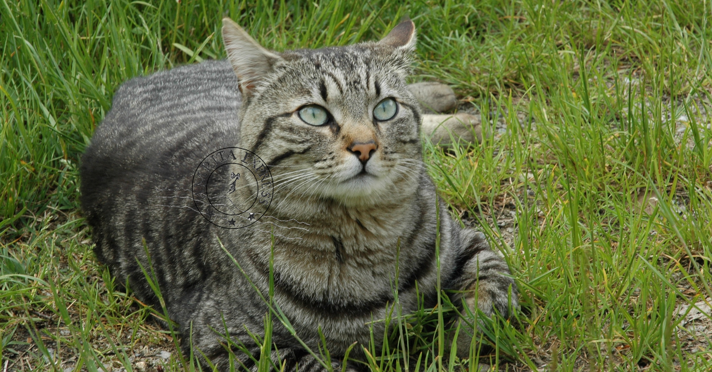
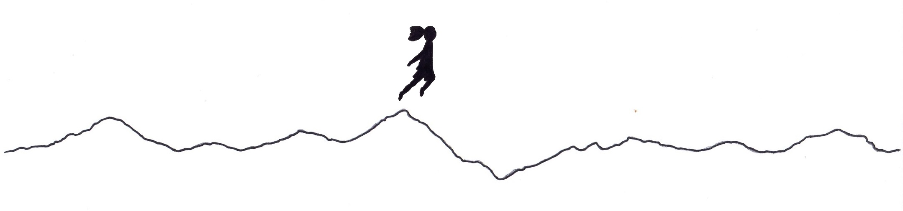

# Amrita Express | EN
*Stella's Journey: a narrative path through solitude and hope.*

### About | Stella's Voice
Stella is different.  
Stella is a serious soul.  
Steady, precise, dynamic—in constant, stubborn connection with a thousand diverse thoughts; deep, constructive, fired off in different directions and often unfenceable.  
Unique.  
Stella needs to write to live. To somehow confront her own complexity. Too many times she has missed the rhythm of reading and writing, re-reading and rewriting, one day after the next.  
Now, she will strive to always be herself.  

Solitude, determination, and hope.  
Amrita Express.  

  

### Lates Posts
* [On The Way (26-10-2025)](2025-10-26-on-the-way.md)

_Listen to the sounds that shaped this journey:_ 
[Amrita Express Soundtrack on Spotify](https://open.spotify.com/playlist/5hjxVVAKMyPxwsN4nNnfcf)

---

### Author's Note
This blog is a clumsy literary experiment; it does not recount real events but invented stories, gathering random words that do not deserve to be called poems. However, the gratitude scattered throughout is sincere.  

This English edition is a collaborative project between the author and Gemini 3 Flash (the April 2026 version of Google’s large language model). Together, we try to refine the fragments, seeking to preserve the essence of the original written voice.

---

[← Return to Amrita Express](https://stellaboschi.github.io/amrita-express/)  
[← Return to Stella Boschi's Main Hub](https://stellaboschi.github.io/)

---

*Copyright © 2000–2026 by Stella Boschi – All rights reserved.*
