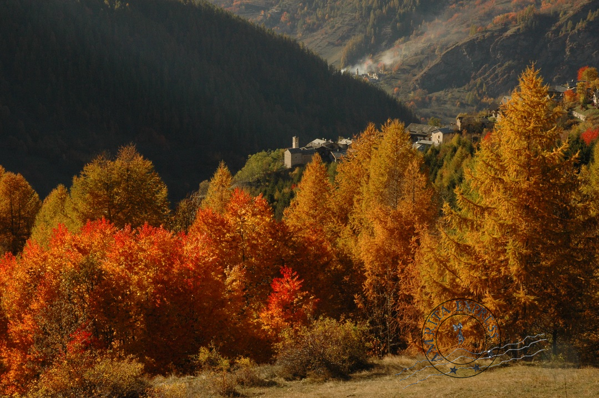
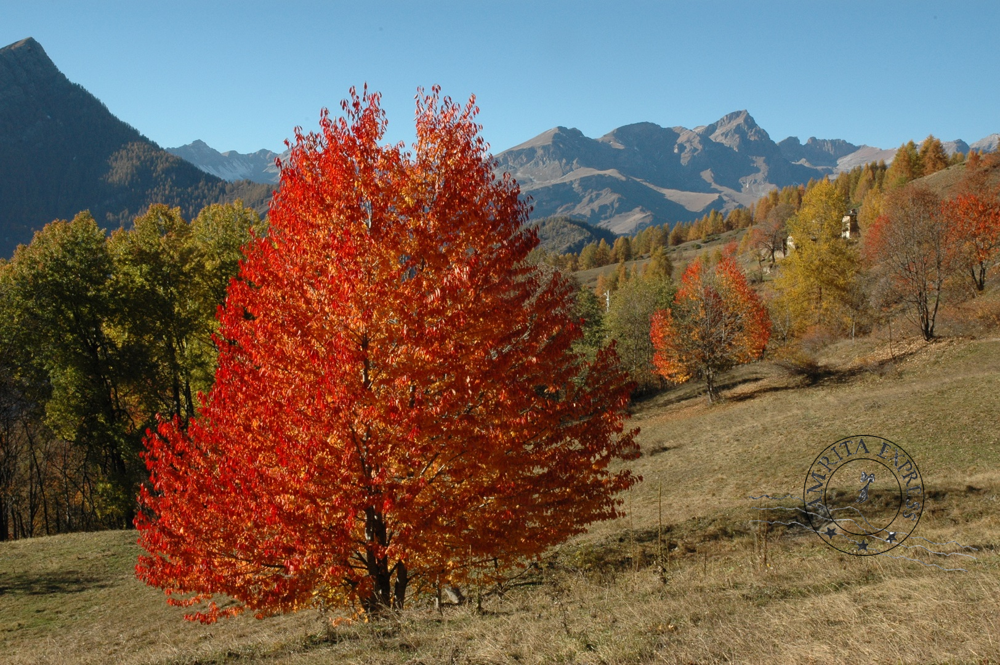
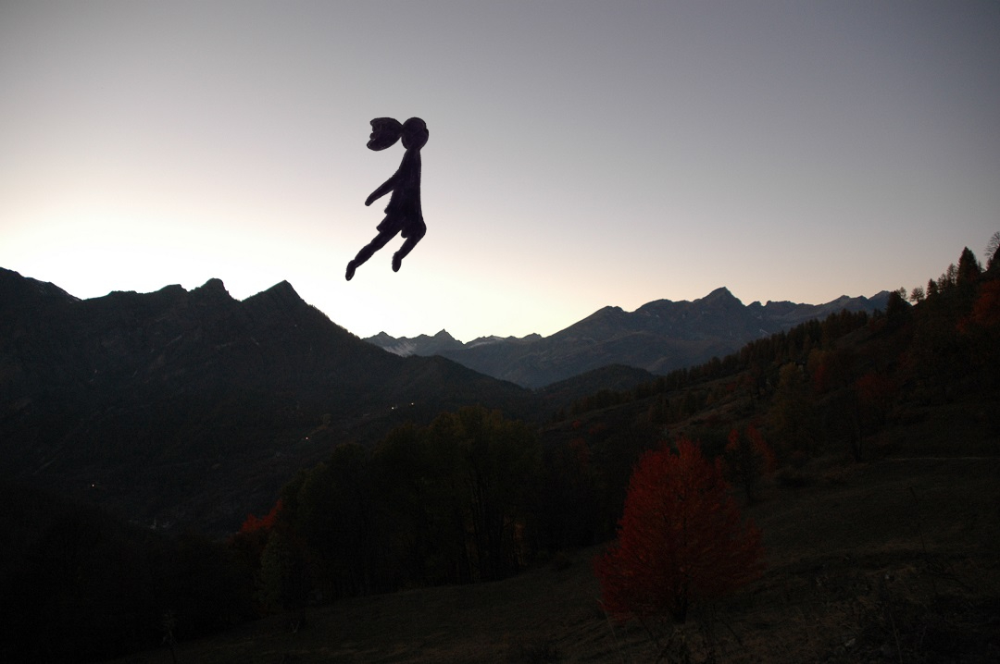

# On The Way | Verso l'altipiano
(Few words)

 
   
    
  <em>Marmora, Maira Valley</em> 

Ieri ho ricevuto il catalogo Ingegnoli per posta e mi sono immaginata questa scena, come una fotografia, uno sbirciare fugace dal buco della serratura, come un'istantanea:

*Una casa presa in affitto già ammobiliata, i mobili fuori tempo e accostati senza criterio, la luce svogliata delle lampadine a risparmio energetico. C'è un uomo di mezza età dall'aria dimessa curvo sulla scrivania, davanti ai suoi occhi, nell'unica parte ben illuminata della casa, una rivista nuovissima, scintillante. In copertina  peperoni di tutti i colori: è il catalogo dell'azienda agricola Ingegnoli di Milano, un'istituzione nel campo delle sementi per l'agricoltura. E poi c'è lui, che non ha mai nemmeno toccato la terra con le mani, se non, forse, una volta, quando in un tempo lontanissimo che non sembra nemmeno probabile, fu un bambino. E cosa fa? Lo impara a memoria. Lo legge e rilegge come se fosse importante. Come se fosse un gioco a cui battere degli avversari immaginari, come se lui stesso fosse un uomo senza futuro e senza passato, tutto buttato dentro quel catalogo, loro due una cosa soltanto.* 

E così ho fatto questo piccolo viaggio a occhi aperti, e ancora prima di sapere qualcos'altro su di lui, sono ritornata in me e lì per lì mi sono sentita triste. Ho desiderato essere lui, o meglio, avere il suo talento, poter avere anch'io un'abilità speciale come saper imparare un catalogo di semi a memoria. 

Che poi, chiariamolo subito, quel tipo non è affatto una persona speciale, e non è davvero in grado di tenere a mente tutto il catalogo, solo abbastanza abile con la memoria da poter sostenere una conversazione con agricoltori esperti, come se volesse fingere di essere come loro. 

Ma io non sono così e lì per lì mi sono dispiaciuta. Poi l'epifania, ho realizzato che in questo sta la bellezza di scrivere. E in questo, soprattutto, sta il succo della mia vita, l'essenza - anche se non il senso: l'immaginare di essere chi non sono. Forse perché vorrei davvero essere diversa da ciò che sono o forse semplicemente perché questa è la mia natura, essere una persona immaginaria.

## An Imaginary Person  

Un'altra immagine che mi viene in mente di continuo pensando a questo omino e al suo catalogo è lo scrivano Bartleby, ma non so il perché, tra l’altro non ho mai letto quel libro, anche se vorrei averlo già fatto. Quindi nel frattempo si è aggiunta una fantasticheria dove ci sono io che vado alla biblioteca a cercare il libro (Bartleby, lo scrivano) e chiedo aiuto ai bibliotecari perché non riesco a trovarlo. Insomma alla fine mi sono spinta fino al pensiero di portargli un regalo per Natale per ringraziarli dell’aiuto. Così è la mia vita nelle nuvole. 

Tornando al tipo strano del catalogo: il punto è che io per un attimo l'ho invidiato, ho desiderato essere lui, non essere più me stessa ma quel personaggio dall'esistenza insignificante però così intrigante da attirare la mia attenzione. E invece no, sono io, che alla fine non sono niente di che. Però poi, per un attimo, sono rinsavita e mi sono ricordata della mia fortuna: che con l'immaginazione posso essere lui ogni volta che voglio, che allo stesso modo posso immaginare di fumare e può essere quasi la stessa cosa. Insomma scrivere per godere della vita, per giocare ad essere chiunque io desideri, secondo il mio puro istinto, senza dover rendere conto a nessuno, e senza, per questo, nuocere a nessuno. Solo io e la mia immaginazione. Liberi. 
Perciò io scrivo per essere libera, per avere il sollievo di non essere me stessa almeno per un po'. Per puro divertimento, tanto questo è ciò che si merita la vita. Nulla di serio, e io lo sono fin troppo. 
Scappare di qua e di là con la mente è la strategia migliore per sopravvivere a me stessa. Non riesco a pensare a nulla di meglio.

 
   
    
  <em>Sfumature d'autunno a Marmora</em> 

Ed ora veniamo a qualcosa di davvero importante: l’altipiano.
Qui vicino al paese dove mi sono trasferita da poco c’è un sentiero tra le montagne che conduce a una vallata nascosta tra le cime, non la vedi finché non ci sei  dentro e, magicamente, proprio nell’istante in cui ne varchi la soglia, il sentiero dietro di te sparisce tra le le rocce.
Ma attenzione, per arrivare in questo luogo perfetto, definitivo, ultimo, è necessario un percorso di avvicinamento preciso e determinato, non devi farti assolutamente distrarre, nessuno ti deve intercettare per farti cambiare strada, devi avere fiducia e rimanere concentrato, mantenere la mente lucida e restare focalizzato.

*Soundtrack - We Can Be Strong, Willy Mason (per la salita)*

 
   
    
  <em>Flying Amrita</em> 

---  

## At Home | Here and Now
09/01/2026  
Post Scriptum

Ora che sono qui sull’altipiano, lo spazio e il tempo sono fermi: ho tutto il tempo che desidero perché non devo andare da nessun'altra parte, ho tutto quello che mi serve perché tutto il tempo mio è qua e non c'è nessun altro posto al mondo dove dovrei essere, e non c'è nemmeno un altro tempo o un tempo che scorre altrove, perché in questo spazio è racchiuso tutto il mio passato, tutto il mio futuro.
Sono arrivata. E Amrita è con me.

*Soundtrack - Say Why, Zach Bryan (per l’arrivo)*

 
 

## A story for you
[Alberi Senza Radici - Rootless Trees, Stella Boschi, 2003](https://stellaboschi.github.io/alberi-senza-radici.html)

 
 

## More
Foto scattate con Nikon D70

**Thanks for inspiring me:**
* [Fratelli Ingegnoli Milano](https://www.ingegnoli.it)
* *Bartleby, the Scrivener: A Story of Wall Street*, Herman Melville, 1853
* *The Order of Time*, Carlo Rovelli, 2017

**Maira Valley**  
[Comune di Marmora (CN)](https://www.comune.marmora.cn.it/)  
[Consorzio Turistico Valle Maira](https://www.vallemaira.org/)  
[in Val Maira.it • Portale di arte, cultura, storia e tradizioni di una delle più belle Valli Occitane](https://www.invalmaira.it/)  
  
---

[← Return to Amrita Express - IT](index.md)  
[← Return to Stella Boschi's Main Hub](https://stellaboschi.github.io/)

---  

---
title: On The Way
date: 2025-10-26
project: Amrita Express
language: en
tags:
  - Few Words
  - Thanks to
---

# On The Way
(Few words)

 
   
    
  <em>Marmora, Maira Valley</em> 

Yesterday, the Ingegnoli catalog arrived in the mail and I imagined this scene: like a photograph, a fleeting glimpse through a keyhole, a snapshot:

*A rented, pre-furnished house; furniture out of time, put together without criteria; the listless glow of energy-saving light bulbs. There is a middle-aged man with a humble air, hunched over his desk. Before his eyes, in the only well-lit part of the house, lies a brand-new, glossy magazine. On the cover, peppers of every color: it is the catalog of the Ingegnoli farm in Milan, an institution in the field of agricultural seeds. And then there is him, who has never even touched the earth with his hands, except, perhaps, once, in a distant time that doesn't even seem probable, when he was a child. And what does he do? He learns it by heart.
He reads and re-reads it as if it were important. As if it were a game to beat imaginary opponents, as if he himself were a man without future or past, entirely poured into that catalog, the two of them becoming a single thing.*

And so, I took this little daydream trip, and even before knowing anything else about him, I returned to myself and, in that moment, I felt sad. I wished I were him—or rather, that I had his talent, that I too could have a special skill like knowing a seed catalog by heart.

Mind you, let’s be clear: that guy isn’t a special person at all, and he isn’t truly capable of memorizing the whole catalog; he is just skilled enough with his memory to hold a conversation with expert farmers, as if he wanted to pretend to be like them.

But I am not like that, and for a moment, I felt sorry for myself. Then the epiphany: I realized that this is the beauty of writing. And in this, above all, lies the juice of my life, the essence, if not the meaning: imagining being who I am not. Perhaps because I truly wish I were different from who I am, or perhaps simply because this is my nature: to be an imaginary person.

## An Imaginary Person  

Another image that constantly comes to mind when thinking about this little man and his catalog is Bartleby, the Scrivener, but I don’t know why. By the way, I’ve never read that book, though I wish I already had. So, in the meantime, a daydream has been added where I go to the library to look for the book (Bartleby, the Scrivener) and ask the librarians for help because I can't find it. In the end, I even went as far as thinking of bringing them a Christmas gift to thank them for their help. Such is my life in the clouds.

Returning to the strange guy with the catalog: the point is that for a moment I envied him; I wanted to be him, to no longer be myself but that character with an insignificant yet so intriguing existence that he caught my attention. But no, it's me, who, in the end, am nothing special.

Yet then, for a second, I came to my senses and remembered my luck: that through imagination I can be him whenever I want, just as I can imagine smoking and it can be almost the same thing. In short, writing to enjoy life, to play at being whoever I desire, according to my pure instinct, without having to answer to anyone, and without harming anyone in the process. Just me and my imagination. Free.

Therefore, I write to be free, to have the relief of not being myself at least for a while. For pure fun; after all, this is what life deserves. Nothing serious, and I am far too much so. Escaping here and there with my mind is the best strategy to survive myself. I cannot think of anything better.

 
   
    
  <em>Autumn shades in Marmora</em> 

And now we come to something truly important: the plateau.  
Near the village where I recently moved, there is a trail through the mountains that leads to a valley hidden among the peaks; you cannot see it until you are inside and, magically, at the very instant you cross the threshold, the trail behind you vanishes into the rocks.  
But beware: to reach this perfect, definitive, ultimate place, a precise and determined approach is necessary. You must not let yourself be distracted; no one must intercept you or lead you astray. You must have faith and stay focused, keeping a clear mind and remaining centered.

*Soundtrack - We Can Be Strong, Willy Mason (for the climb)*

 
   
    
  <em>Flying Amrita</em> 

---  

## At Home | Here and Now
09/01/2026  
Post Scriptum

Now that I am here on the plateau, space and time are still: I have all the time I desire because I don’t have to be anywhere else; I have everything I need because all my time is here, and there is no other place in the world where I should be. There isn't even another time, or a time flowing elsewhere, because within this space, all my past and all my future are enclosed.  
I have arrived. And Amrita is with me.

*Soundtrack - Say Why, Zach Bryan (for the arrival)*

 
 

## A story for you
[Rootless Trees, Stella Boschi, 2003](https://stellaboschi.github.io/alberi-senza-radici.html)

 
 

## More
Photos taken with Nikon D70

**Thanks for inspiring me:**
* [Fratelli Ingegnoli Milano](https://www.ingegnoli.it/eng/)
* *Bartleby, the Scrivener: A Story of Wall Street*, Herman Melville, 1853
* *The Order of Time*, Carlo Rovelli, 2017

**Maira Valley**  
[Municipality of Marmora (CN) — Piedmont, Italy](https://www.comune.marmora.cn.it/)  
[Valle Maira Tourism Consortium](https://www.vallemaira.org/en/)  
[In Val Maira - Portal for local art, culture and history (IT)](https://www.invalmaira.it/)  
  
---

*Translation note: This English edition is a collaborative project between the author and Gemini 1.5 Flash (the April 2026 version of Google’s large language model). Together, we try to refine the fragments, seeking to preserve the essence of the original written voice.*  

[← Return to Amrita Express - EN](index.md)  
[← Return to Stella Boschi's Main Hub](https://stellaboschi.github.io/)  

---
  
*Copyright © 2000–2026 by Stella Boschi – All rights reserved.*  
